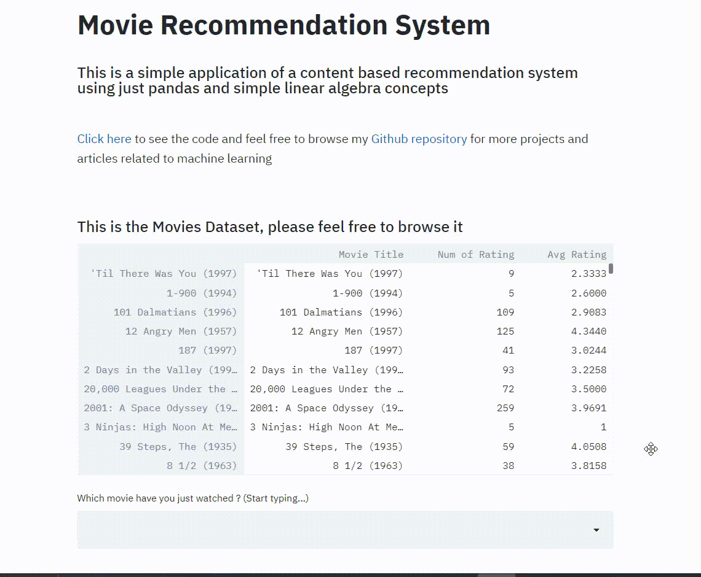
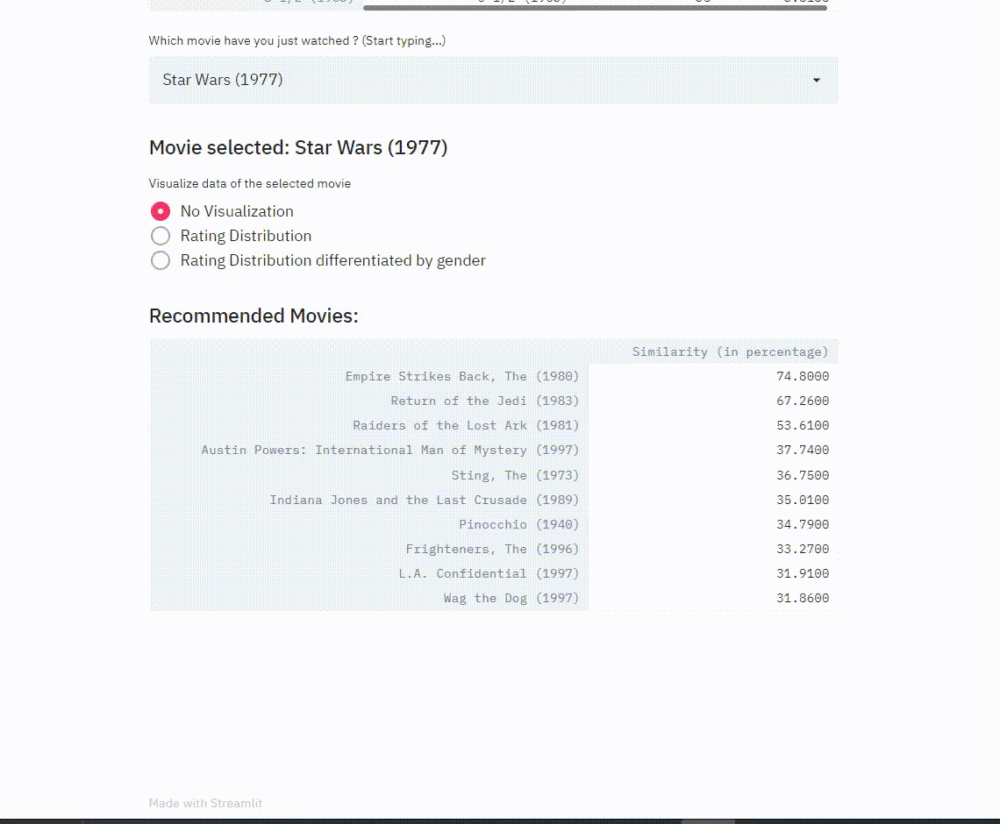

# **Movie Recommendation System**

### This is a simple project that uses basic linear algebra and libraries like Numpy, pandas and seaborn to create a **content-based recommender system**. There is a python notebook for **explanation of the applied concepts used for building this project from scratch**, please [click here](<https://github.com/aryanchugh816/Data-Science/blob/master/PROJECTS/01%20-%20Movie%20Recommendation%20System/Movie%20Recommendation%20System%20(%20Content%20Based%20).ipynb>) to visit it.  This project is built using Streamlit and hosted on Heroku, you can see the ["_index.py_"](https://github.com/aryanchugh816/Data-Science/blob/master/PROJECTS/01%20-%20Movie%20Recommendation%20System/index.py) file for the source code.  _Link to an article explaining this whole code and concept will be uploaded soon._

## **Highlights:**

1. Full movies database can be viewed at a glance on the home page  
2. Selection of movie using a drop down list that integrates smart regex to find your movie as you type movie name 
     
3. Visualizing data related to the movie with easy to read recommendations  
   

### If you like any of my work please feel free to contact me related to any project collaboration or job opportunity
